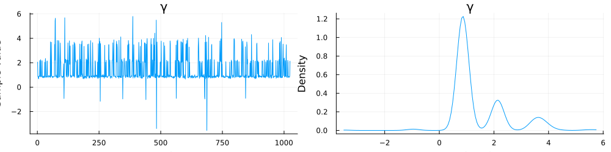

# Parameter Estimation

This brief tutorial explains how to performance Bayesian parameter estimation of the QPDM using [Pigeons.jl](https://github.com/Julia-Tempering/Pigeons.jl). One complication in estimating the parameters of the QPDM is that the posterior distributions may have multiple modes, which leads to convergence problems with most MCMC algorithms. Pigeons.jl uses a special type of parallel tempering to overcome this challenge. An additional advantage of using Pigeons.jl is the ability to compute Bayes factors from the log marginal likelihood using the function `stepping_stone`.

## Load Packages

First, we will load the required packages below. 

```julia
using Pigeons
using QuantumPrisonersDilemmaModel
using Random
using StatsPlots
using Turing
```

## Generate Simulated Data

The next step is to generate some simulated data from which the parameters can be estimated. In the code block below, the utility parameter $\mu_d$ is set to one and the entanglement parameter is set to $\gamma = 2$.  A total of 50 trials is generated for each of the three conditions. The resulting values represent the number of defections per condition out of 50.
```julia
Random.seed!(65)
n = 50
parms = (μd=1.0, γ=2.0)
model = QPDM(;parms...)
data = rand(model, n)
```

## Define Turing Model

The next step is to define a Turing model with the `@model` macro. For simplicity, we will fix the utility parameter $\mu_d=1$ and set the prior of the entanglement parameter to $\gamma \sim \mathrm{normal}(0,3)$. 

```julia 
@model function turing_model(data, parms)
    γ ~ Normal(0, 3)
    data ~ QPDM(;parms..., γ)
end
```

## Estimate Parameters

To estimate the parameters, we need to pass the Turing model to `pigeons`. The second command converts the output to an `MCMCChain` object, which can be used for plotting
```julia
pt = pigeons(
    target=TuringLogPotential(turing_model((n, data), parms)), 
    record=[traces])
samples = Chains(sample_array(pt), ["γ","LL"])
```
The trace of the `pigeon`'s sampler is given below:
```julia
────────────────────────────────────────────────────────────────────────────
  scans        Λ      log(Z₁/Z₀)   min(α)     mean(α)    min(αₑ)   mean(αₑ) 
────────── ────────── ────────── ────────── ────────── ────────── ──────────
        2       1.58      -11.3      0.332      0.825          1          1 
        4      0.529      -10.1      0.522      0.941          1          1 
        8       1.11      -9.43      0.501      0.877          1          1 
       16       1.37      -9.89       0.66      0.847          1          1 
       32       1.48      -10.3      0.772      0.836          1          1 
       64       1.46      -10.1      0.735      0.837          1          1 
      128       1.44      -10.4      0.776       0.84          1          1 
      256       1.49      -10.4      0.772      0.834      0.999          1 
      512       1.46      -10.3      0.816      0.838      0.999          1 
 1.02e+03       1.48      -10.3      0.817      0.836      0.999          1 
────────────────────────────────────────────────────────────────────────────
```

## Plot Posterior Distribution 

Now we can plot the posterior distribution of $\gamma$ with `plot`. The posterior distribution of $\gamma$ has a primary mode around 1 and secondary modes around 2 and 3.5.
```julia 
plot(samples)
```

